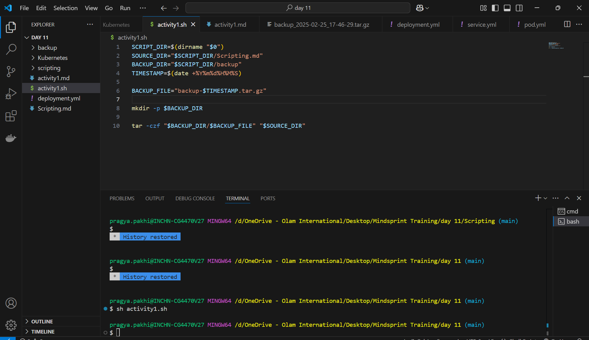
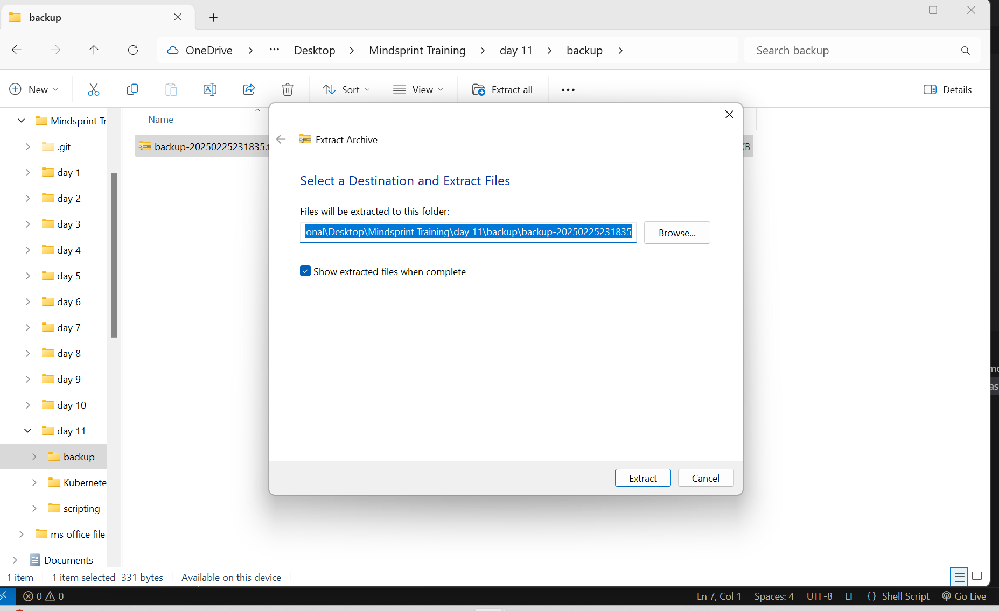
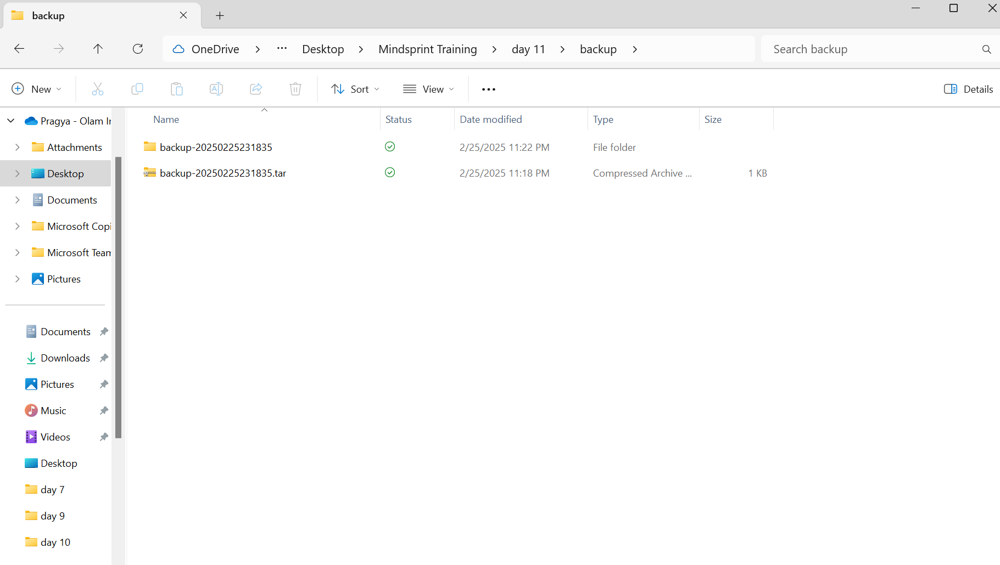
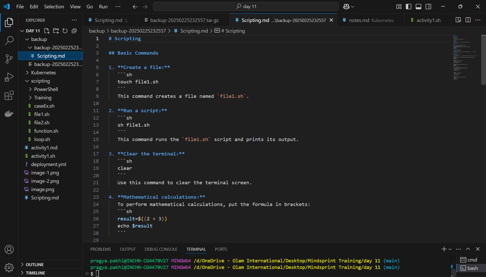
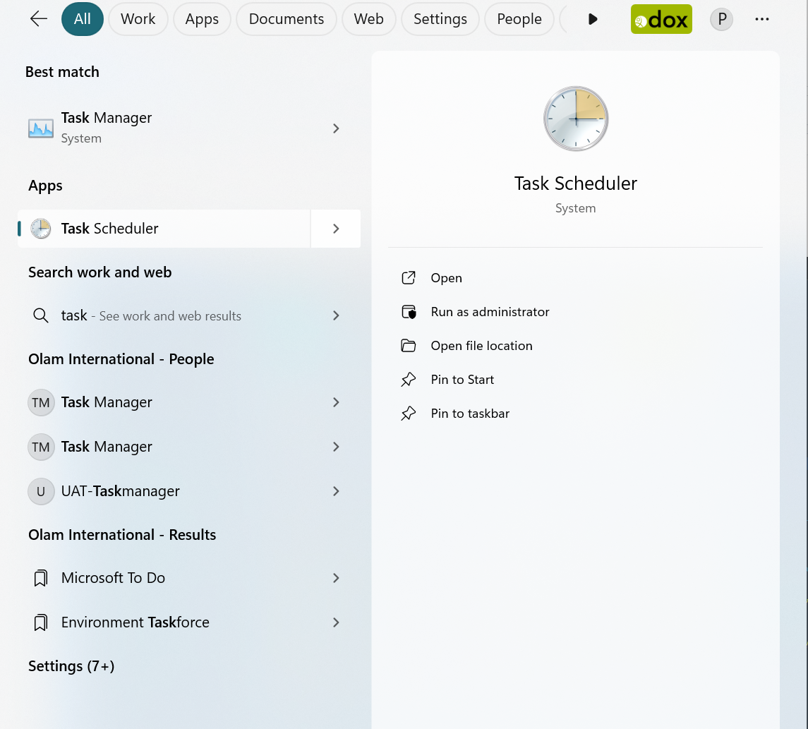
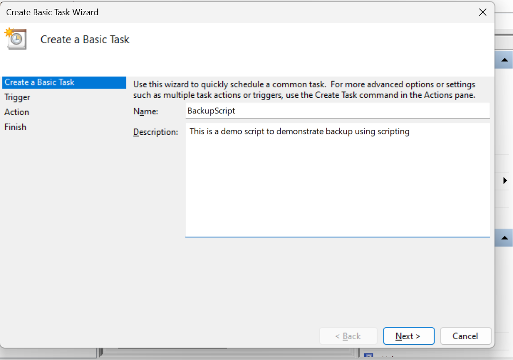
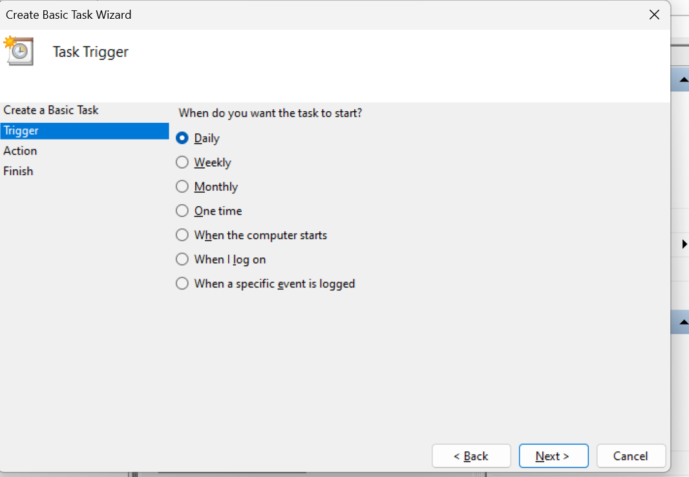
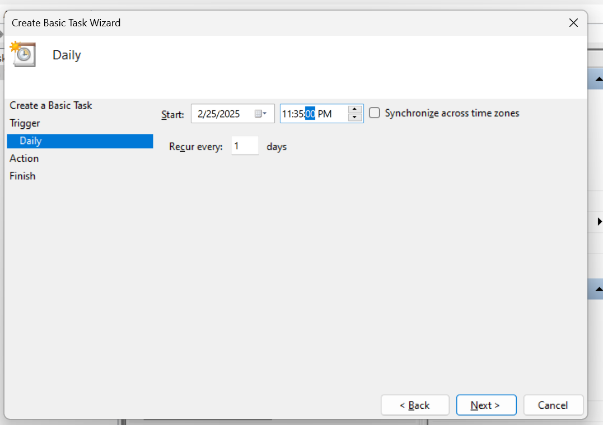
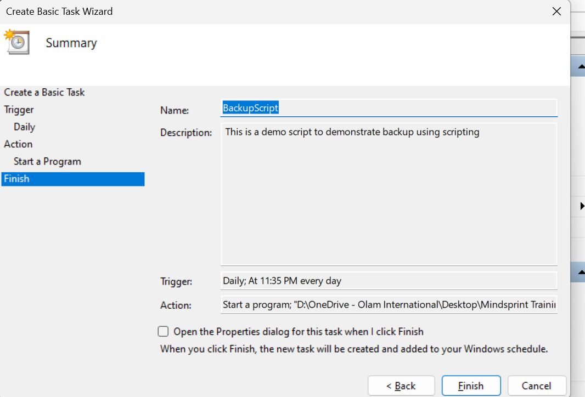
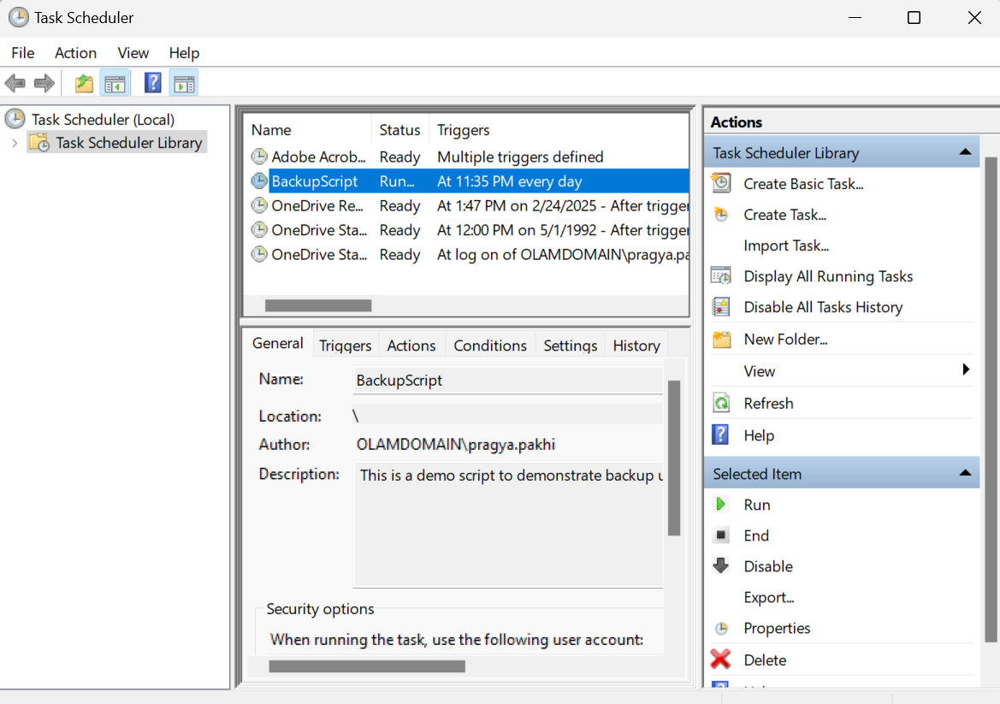

# Automated File Backup : Implementation with Shell Scripts and Task Scheduler


## Creating the Backup Shell Script

### Step 1: Write the Shell Script

First, we need to create a shell script that will handle the backup process:

1. Create a new file named `backup.sh` with the following code:

```sh
#!/bin/bash

# Get the directory where the script is located
SCRIPT_DIR=$(dirname "$0")

# Define source and backup directories
SOURCE_DIR="$SCRIPT_DIR/Documents"
BACKUP_DIR="$SCRIPT_DIR/backup_files"

# Create timestamp for unique backup naming
TIMESTAMP=$(date +%Y%m%d_%H%M%S)
BACKUP_FILE="backup_$TIMESTAMP.tar.gz"

# Create backup directory if it doesn't exist
mkdir -p "$BACKUP_DIR"

# Display backup information
echo "Creating backup of $SOURCE_DIR"
echo "Backup will be saved to $BACKUP_DIR/$BACKUP_FILE"

# Create a compressed backup
tar -czf "$BACKUP_DIR/$BACKUP_FILE" "$SOURCE_DIR"

# Confirm backup completion
echo "Backup completed successfully!"
echo "Backup saved as $BACKUP_DIR/$BACKUP_FILE"
```

2. Save this file in a convenient location, such as your Documents folder.


### Step 2: Make the Script Executable

Before running the script, you need to make it executable:

1. Open a terminal (Git Bash, WSL, or similar bash environment on Windows)
2. Navigate to the directory containing your script

### Step 3: Run the Script Manually

Let's test the script to make sure it works properly:

1. Execute the script by running:

```sh
./backup.sh
```



2. You should see output indicating that the backup process has started and completed.


## Verifying the Backup Files

### Step 1: Check the Backup Directory

1. Navigate to the backup directory specified in your script.
2. You should see a compressed `.tar.gz` file with a timestamp in its name.


### Step 2: Extract and Verify the Backup

To ensure the backup contains the expected files:

1. Extract the backup.

2. Replace the filename with your actual backup 



3. Check the extracted files to ensure all content has been backed up correctly.



## Automating Backups with Task Scheduler

Now let's set up Task Scheduler to run our backup script automatically at specified intervals.

### Step 1: Open Task Scheduler

1. Press the Windows key and search for "Task Scheduler"
2. Open the Task Scheduler application



### Step 2: Create a New Task

1. In the Task Scheduler window, click on "Create Basic Task" in the right panel
2. Enter a name for your task (e.g., "Daily File Backup") and a description (optional)
3. Click "Next" to continue



### Step 3: Set the Trigger

1. Choose when you want the backup to run:
   - Daily: For daily backups
   - Weekly: For weekly backups
   - Monthly: For monthly backups
2. Set the start time and recurrence pattern
3. Click "Next"



### Step 4: Configure the Action

1. Select "Start a program" as the action
2. Click "Next"
3. Browse to the location of your `backup.sh` script
4. For the "Start in" field, enter the directory where your script is located
5. Click "Next"



### Step 5: Complete the Setup

1. Review your task settings
2. Check the "Open the Properties dialog for this task when I click Finish" box if you want to make additional configurations
3. Click "Finish"



### Step 6: Additional Task Properties (Optional)

In the Properties dialog, you can:

1. Configure the task to run with elevated privileges by checking "Run with highest privileges"
2. Set conditions for when the task should run (e.g., only when the computer is idle)
3. Define how the task should be handled if it is missed (e.g., if the computer was off)
4. Click "OK" to save your settings


